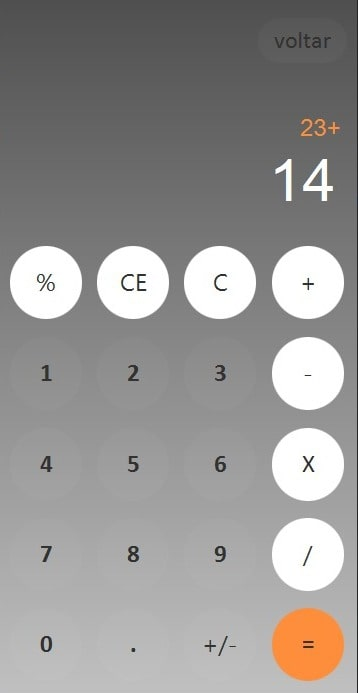

# Calculator

My first project posted here in github, it's very simple but i really like this

## Table of contents

- [Overview](#overview)
    - [The challenge](#the-challenge)
    - [Screenshot](#screenshot)
- [My process](#my-process)
    - [Built with](#built-with)
    - [What I learned](#what-i-learned)

## Overview

### The challenge

Users should be able to:

- Perform basics calculations and percentage.
- Also use float numbers.

### Screenshot

## My process

### Built with

- Java
- JavaFX
- SceneBuilder
- CSS

### What I learned

During the development of this project, I learned several important skills and concepts, including:

- How to use SceneBuilder to create user interfaces
- How to implement basic arithmetic operations in Java
- How to use JavaFX to create a responsive and interactive user interface

Looking back at this project, I realize that it would have been better to create a separate class to perform the calculations. However, this was my first project, and I'm still learning. I have since improved my knowledge and skills and will definitely take this into consideration for future projects.

### Continued development

While I enjoyed working on this project and learning about JavaFX, I have since moved on to other technologies such as React, which I find to be more powerful and flexible. As a result, I may not work with JavaFX as much in the future.

Instead, I plan to focus on other areas of Java development, particularly Spring, a popular Java framework used for building enterprise-level applications. I also aim to continue improving my knowledge of OOP principles to enhance my programming skills and produce high-quality code.

That being said, I still believe that this project was a valuable learning experience for me. The skills and concepts I learned while working on this project, such as using SceneBuilder to create user interfaces and implementing basic arithmetic operations in Java, will undoubtedly prove useful in my future endeavors.
